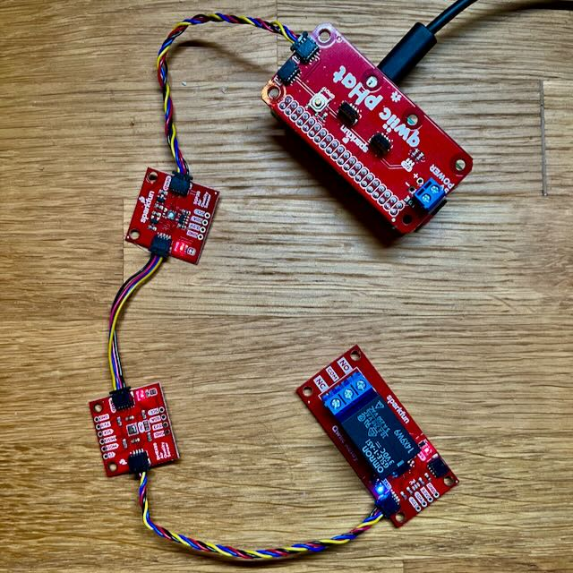
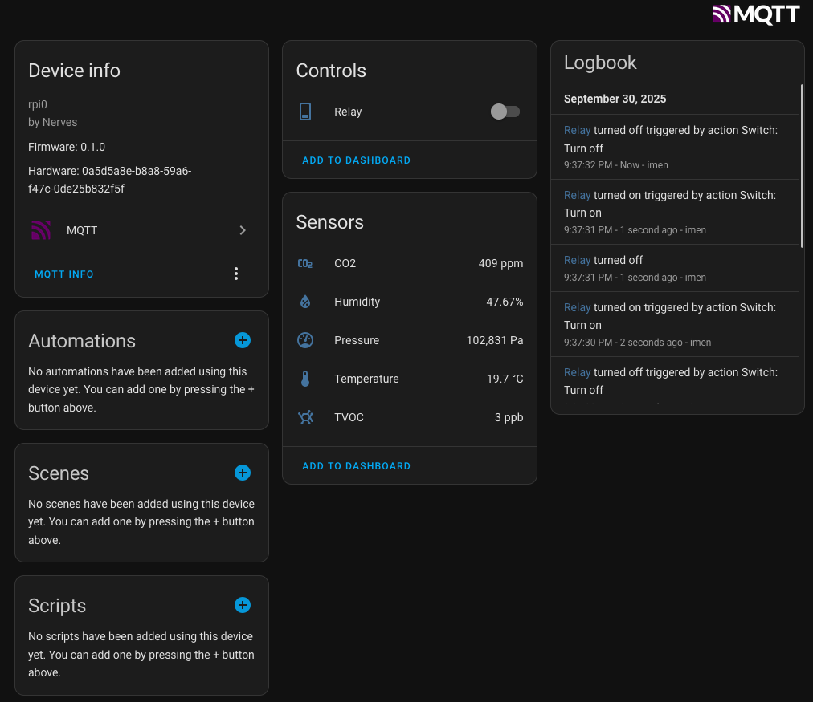

# Homex Nerves Example

An example Nerves project for the [`homex`](https://github.com/kevinschweikert/homex) Elixir library

It uses the followind sensors/actuators:

- BME680 weather sensor
- SGP30 air quality sensor
- Relay

The followind entities are automatically created in [Home Assistant](https://www.home-assistant.io/):

- Temperature
- Humidity
- Pressure
- CO2
- TVOC
- Switch

## Usage

Edit the `:homex` config in `target.exs` to point the broker configuration to the correct IP address in your network. [Set up Home Assistant to use the same MQTT broker](https://www.home-assistant.io/integrations/mqtt/).

## Targets

Nerves applications produce images for hardware targets based on the
`MIX_TARGET` environment variable. If `MIX_TARGET` is unset, `mix` builds an
image that runs on the host (e.g., your laptop). This is useful for executing
logic tests, running utilities, and debugging. Other targets are represented by
a short name like `rpi3` that maps to a Nerves system image for that platform.
All of this logic is in the generated `mix.exs` and may be customized. For more
information about targets see:

https://hexdocs.pm/nerves/supported-targets.html

## Getting Started

To start your Nerves app:

- `export MIX_TARGET=my_target` or prefix every command with
  `MIX_TARGET=my_target`. For example, `MIX_TARGET=rpi3`
- Install dependencies with `mix deps.get`
- Create firmware with `mix firmware`
- Burn to an SD card with `mix burn`

## Learn more

- Official docs: https://hexdocs.pm/nerves/getting-started.html
- Official website: https://nerves-project.org/
- Forum: https://elixirforum.com/c/nerves-forum
- Elixir Slack #nerves channel: https://elixir-slack.community/
- Elixir Discord #nerves channel: https://discord.gg/elixir
- Source: https://github.com/nerves-project/nerves
